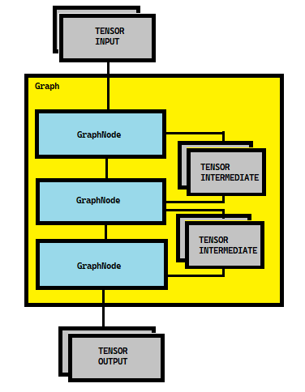

# Vision AI Stack Programmer Guide

**Version:** 1.0
**Author:** Vuong Nguyen
**Project:** https://github.com/ztachip/ztachip
**Contact:** vuongdnguyen@hotmail.com

## 1 - INTRODUCTION

ztachip provides many pre-built acceleration functions for vision and AI applications.

To support these acceleration functions, a graph-based framework is introduced. Different vision and AI functions are connected into a graph of execution nodes.

Users can use this graph framework to integrate their own custom acceleration functions with ztachip vision-ai stack.

## 2 - GRAPH FRAMEWORK

Graph is a ztachip framework used to connect different processing nodes together. It is a particularly popular framework used by many other AI and vision frameworks such as OpenCV, TensorFlow, OpenVX, etc.

Each ztachip acceleration function is packaged as a graph node.

The flow of execution is then specified by how the graph nodes are connected to form a graph.

There can be multiple Graph objects representing different execution flows.

ztachip graph framework is composed of the following C++ classes:

- TENSOR: Objects that encapsulate tensor data objects. They are used as...

- Input tensor data to a graph

- Output result tensor data from a graph.

- Intermediate tensor to transfer data between graph nodes.

- GraphNode

- Unit of execution in a graph. GraphNode takes input data tensor from previous graph nodes and transfer output data tensor to next graph nodes.

- Graph

- Objects that represent the graph.

### 1.1 Graph structure



Diagram below illustrates how the main objects of a Graph are interconnected.

### 1.2 TENSOR

TENSOR class encapsulates tensor data objects.

Data exchanged between graph nodes is carried by TENSOR objects.

#### 1.2.1 Class Interface

```text
1.2.1.1
TENSOR()
```

Default constructor without initialization.

```text
1.2.1.2
TENSOR(
```

```text
TensorDataType _dataType,
TensorFormat _fmt,
TensorObjType objType,
std::vector<int> &dim,
void *shm)
```

Constructor with initialization.

Input

|  |  |
| --- | --- |
| dataType<br>_ | Data type of this tensor.<br>Reference 1.2.2.1 for TensorDataType definition. |
| fmt<br>_ | Layout format of this tensor<br>Reference 1.2.2.2 for TensorFormat definition |
| objType | Object type of this tensor<br>Reference 1.2.2.3 for TensorObjType definition. |
| dim | Dimension size of this tensor. |
| shm | If non-zero then use this parameter as memory allocation block for this tensor.<br>In this case, this object does not own this memory block and will not free it<br>when done.<br>If zero, then allocate new memory block for this tensor. The memory is owned<br>by this object will be freed by this object's destructor. |

```text
1.2.1.3
ZtaStatus Create(
```

```text
TensorDataType _dataType,
TensorFormat _fmt,
TensorObjType _objType,
std::vector<int> &dim,
ZTA_SHARED_MEM _shm=0)
```

Call to initialize this object when default constructor was used.

Parameters are like 1.2.1.2

Output:

- ZtaStatusOk if successful

- ZtaStatusFail otherwise.

```text
1.2.1.4
ZtaStatus Clone(TENSOR *other)
```

To initialize this object to have the same parameters as another tensor. New memory block is also allocated and initialized to have the same contents as the other tensor.

Input

|  |  |
| --- | --- |
| other | Reinitialize this tensor with contents of 'other' tensor. |

Output:

- ZtaStatusOk if successful

- ZtaStatusFail otherwise.

```text
1.2.1.5
ZtaStatus Alias(TENSOR *other)
```

Initialize this object to be a reference to another TENSOR object.

Input

|  |  |
| --- | --- |
| other | This object is just a reference to the 'other' tensor.<br>This tensor does not own its data contents since it is just referencing other<br>tensor's data contents. |

Output:

- ZtaStatusOk if successful

- ZtaStatusFail otherwise.

```text
1.2.1.6
ZtaStatus Alias(void *_shm)
```

Data content for this tensor is a reference to a given allocated memory block. This tensor does not own the memory block and will not free it upon completion.

Input

|  |  |
| --- | --- |
| shm<br>_ | This tensor's data content is referencing ' shm' memory block.<br>_ |

Output:

- ZtaStatusOk if successful

- ZtaStatusFail otherwise.

```text
1.2.1.7
ZtaStatus CreateWithBitmap(
```

```text
const char *bmpFile,
TensorFormat fmt=TensorFormatSplit)
```

```text
Initialize this tensor with the dimensions of a bitmap.
Load the bitmap content into this tensor.
```

```text
Input
```

|  |  |
| --- | --- |
| bmpFile | File name of the bitmap to initialize this tensor with.<br>Bitmap file must be 24-bit BMP format. |
| Fmt | Layout format of this tensor.<br>Reference 1.2.2.2 for TensorFormat definition. |

Output:

- ZtaStatusOk if successful

- ZtaStatusFail otherwise.

```text
1.2.1.8
TensorDataType GetDataType()
```

Return data type of this tensor. Reference 1.2.2.1 for TensorDataType definition.

```text
1.2.1.9
TensorFormat GetFormat()
```

Return data layout format of this tensor. Reference 1.2.2.2 for TensorFormat definition.

```text
1.2.1.10
TensorObjType GetObjType()
```

Return object type of this tensor. Reference 1.2.2.3 for TensorObjType definition.

```text
1.2.1.11
std::vector<int> *GetDimension()
```

Return dimension list of this tensor. The list starts with size of outer-most dimension and ends with size inner-most dimension.

```text
1.2.1.12
int GetDimension(int _idx)
```

Return size of a dimension of this tensor.

Input

|  |  |
| --- | --- |
| idx<br>_ | Dimension index to return its size.<br>idx ranges from 0 to (num dimension-1) with 0 means outer-most<br>_ _<br>dimension and (num dimension-1) means inner-most dimension.<br>_ |

Output:

- ZtaStatusOk if successful

- ZtaStatusFail otherwise.

```text
1.2.1.13
void *GetBuf()
```

Return data buffer address of this tensor.

```text
1.2.1.14
int GetBufLen()
```

Return total length of data buffer of this tensor.

```text
1.2.1.15
static size_t GetTensorSize(std::vector<int>& shape)
```

This is a utility function that returns the buffer size for a tensor with a particular dimension.

Size return is number of elements for the tensor.

#### 1.2.2 Data Types

```text
1.2.2.1
TensorDataType Enumeration
```

This class supports the following data types

|  |  |
| --- | --- |
| TensorDataTypeInt8 | Signed 8-bit integer. |
| TensorDataTypeUint8 | Unsigned 8-bit integer. |
| TensorDataTypeInt16 | Signed 16-bit integer. |
| TensorDataTypeUint16 | Unsigned 16-bit integer. |

```text
1.2.2.2
TensorFormat Enumeration
```

This enumeration supports for the following data layout format

|  |  |
| --- | --- |
| TensorFormatInterleaved | For example with a tensor 3x2<br>In this layout format, tensor elements layout in data buffer is as followed.<br>[0][0]<br>[1][0]<br>[2][0]<br>[0][1]<br>[1][1]<br>[2][1] |
| TensorFormatSplit | For example with a tensor 3x2<br>In this layout format, tensor elements layout in data buffer is as followed.<br>[0][0]<br>[0][1]<br>[1][0]<br>[1][1]<br>[2][0]<br>[2][1] |

```text
1.2.2.3
TensorObjType Enumeration
```

This enumeration supports the following tensor object types

|  |  |
| --- | --- |
| TensorObjTypeRGB | Object type is an image with pixel color in RGB order |
| TensorObjTypeBGR | Image with pixel color in BGR order |
| TensorObjTypeYUYV | Image in YUYV color space. |
| TensorObjTypeMonochrome | Monochrome image but in RGB format with R,G,B<br>having same values |
| TensorObjTypeMonochromeSingleChannel | Monochrome image but only with 1 byte per pixel<br>representing the intensity |
| TensorObjTypeUnknown | Unknown data object type |

### 1.3 GraphNode Class

This is a class template with virtual functions to be implemented by a derived class. Objects with GraphNode as base class are the execution units of a graph.

ztachip acceleration functions implemented by corresponding tensor programs and pcore programs are encapsulated within a derived class of GraphNode.

#### 1.3.1 Class Interface

```text
1.3.1.1
GraphNode()
```

Default constructor

```text
1.3.1.2
ZtaStatus Verify()
```

```text
This is a virtual function to be implemented by a derived class.
The derived class verifies the integrity of this graph node and performs any necessary
initialization required before the start of execution.
```

Output:

- ZtaStatusOk if successful

- ZtaStatusFail otherwise.

```text
1.3.1.3
ZtaStatus Execute(int queue,bool stepMode)
```

```text
This is a virtual function to be implemented by a derived class.
The derived class perform the execution associated with this node.
```

```text
Input
```

|  |  |
| --- | --- |
| queue | There may be multiple graphs running simultaneously.<br>Each graph has a unique queue id.<br>Graph node will use this queue id to generate a unique job-id<br>which will then be passed to ztachip for task completion<br>notification. |
| stepMode | If false, then execute this node till completion.<br>If true, then partially execute this node. This function will<br>be invoked again for the node to continue with the execution.<br>This is useful when a graph node may take a long execution<br>time, and step mode allows execution of a slow graph to be<br>pre-empted by other more critical graph. |

Output:

- ZtaStatusOk if processing is completed successfully.

- ZtaStatusPending if processing is successful but not fully completed. More processing is still

required.

- ZtaStatusFail if errors are encountered.

```text
1.3.1.4
uint32_t GetJobId(int queue)
```

Generate a unique job id for a tensor program execution.

Refer to [1] on how tensor program would use this job-id.

Example in [1] shows that tensor program is waiting for the completion of the task by waiting for the notification message from ztachip about the completion of job-id. However, when tensor program is called from within a graph framework, tensor program must not wait for the completion message since this is done by graph framework instead.

Input

|  |  |
| --- | --- |
| queue | The same as queue id passed from Execute function (1.3.1.3)<br>Each graph has a unique queue id. |

Output:

Unique job id for a tensor processing task.

#### 1.3.2 Example of implementing a graph node.

Below is an example that shows how a new graph node is implemented.

GraphNode primary function is to provide wrapper functions for a tensor program so that tensor program can be invoked as part of a graph execution.

```text
// Declare a new graph node. It is derived from GraphNode
```

```text
class MyGraphNode : public GraphNode {
```

```text
MyGraphNode();
```

```text
~MyGraphNode();
```

```text
ZtaStatus Create(TENSOR *in,TENSOR *out);
```

```text
ZtaStatus Prepare() {}
```

```text
ZtaStatus Verify() {}
```

```text
ZtaStatus Execute(int queue,bool stepMode);
```

```text
private:
```

```text
TENSOR *m_in;
```

```text
TENSOR *m_out;
```

```text
}
```

```text
// Initialize this node.
```

```text
ZtaStatus MyGraphNode ::Create(TENSOR *in,TENSOR *out) {
```

```text
// In this example, output tensor has same format as input tensor
```

```text
m_in=in;
```

```text
m_out=out;
```

```text
m_out->Clone(m_in);
```

```text
return ZtaStatusOk;
```

```text
}
```

```text
// Verify this node.
```

```text
ZtaStatus MyGraphNode ::Verify() {
```

```text
return ZtaStatusOk;
```

```text
}
```

```text
// Prepare for new execution run.
```

```text
ZtaStatus MyGraphNode ::Prepare() {
```

```text
return ZtaStatusOk;
```

```text
}
```

```text
// Execute this node
```

```text
ZtaStatus MyGraphNode ::Execute(int queue,stepMode) {
```

```text
// Get a job id and run the tensor program
```

```text
my_tensor_program(GetJobId(queue),
```

```text
(uint8_t *)m_in->GetBuf(),
```

```text
(uint8_t *)m_out->GetBuf(),
```

```text
m_in->GetBufLen());
```

```text
return ZtaStatusOk;
```

```text
}
```

### 1.4 Graph

Object of this class implements a flow of execution of multiple steps with each step are performed by a graph node. Graph object owns all the graph nodes and coordinates the execution of these nodes. There can be multiple instances of Graph objects with each instance performing a separate task.

#### 1.4.1 Class Interface

```text
1.4.1.1
Graph()
```

Default constructor of this class

```text
1.4.1.2
ZtaStatus Clear()
```

Reset the graph by clearing all the nodes.

Output:

- ZtaStatusOk if successful

- ZtaStatusFail otherwise.

```text
1.4.1.3
ZtaStatus Add(GraphNode *node)
```

Add a graph node to the end of the graph.

Output:

- ZtaStatusOk if successful

- ZtaStatusFail otherwise.

```text
1.4.1.4
ZtaStatus Verify()
```

Verify the integrity of the graph. Graph will then call Verify function of each node in the graph.

Output:

- ZtaStatusOk if successful

- ZtaStatusFail otherwise.

```text
1.4.1.5
ZtaStatus Prepare()
```

This function marks the beginning of a new graph execution. Previous execution results are discarded.

Output:

- ZtaStatusOk if successful

- ZtaStatusFail otherwise.

```text
1.4.1.6
ZtaStatus RunSingleStep()
```

Execute this graph in step mode.

In this mode, this function may have to be called multiple times to reach execution completion.

This mode is useful when we want to run multiple graphs at the same time, and we don't want a slow graph to block the execution of other graphs that are more time critical.

Output:

- ZtaStatusOk if graph processing is completed successfully.

- ZtaStatusPending if graph processing is successful but not fully completed. More processing is still required by calling RunSingleStep() function again.

- ZtaStatusFail otherwise.

```text
1.4.1.7
ZtaStatus RunUntilCompletion()
```

To execute the graph until completion.

Output:

- ZtaStatusOk if successful

- ZtaStatusFail otherwise.

```text
1.4.1.8
bool IsRunning()
```

Return true if graph is currently busy, false if graph is idle and ready to accept a new execution run.

#### 1.4.2 Example running a single graph

Example below shows how a single graph is created and executed.

```text
// Declare graph,node and tensor objects
```

```text
Graph graph;
```

```text
Task1GraphNode node1;
```

```text
Task2GraphNode node2;
```

```text
TENSOR tensor_input,tensor_output,tensor_temp;
```

```text
// Initialize tensor_input dimension and content from a bitmap image
```

```text
tensor_input.CreateWithBitmap(“bitmap.bmp”);
```

```text
// Initialize and attach graph nodes to the graph
```

```text
// node1 executes first, then node1 passes its output to node2 via tensor_temp,
```

```text
// then node2 is the final stage of the graph.
```

```text
// input to the graph is the tensor_input.
```

```text
// output of the graph is the tensor_output.
```

```text
node1.Create(&tensor_input,&tensor_temp);
```

```text
node2.Create(&tensor_temp,&tensor_output);
```

```text
graph.Add(&node1);
```

```text
graph.Add(&node2);
```

```text
// Verify the graph
```

```text
graph.Verify();
```

```text
// Prepare for execution
```

```text
graph.Prepare();
```

```text
// Execute the graph till completion
```

```text
graph.RunUntilCompletion();
```

```text
// Done. Result is now in tensor_output
```

#### 1.4.3 Example running multiple graphs

Example below shows how to create and execute multiple graphs simultaneously

This is like previous example except that there are 2 instances of the graph.

```text
// Declare graph,node and tensor objects
```

```text
Graph graph[2];
```

```text
Task1GraphNode node1;
```

```text
Task2GraphNode node2;
```

```text
Task3GraphNode node3;
```

```text
Task4GraphNode node4;
```

```text
TENSOR tensor_input[2],tensor_output[2],tensor_temp[2];
```

```text
// Initialize tensor_input dimension and content from a bitmap image
```

```text
tensor_input[0].CreateWithBitmap(“bitmap1.bmp”);
```

```text
tensor_input[1].CreateWithBitmap(“bitmap2.bmp”);
```

```text
// Create first graph
```

```text
node1.Create(&tensor_input[0],&tensor_temp[0]);
```

```text
node2.Create(&tensor_temp[0],&tensor_output[0]);
```

```text
graph[0].Add(&node1);
```

```text
graph[0].Add(&node2);
```

```text
graph[0].Verify();
```

```text
graph[0].Prepare();
```

```text
// Create second graph
```

```text
node3.Create(&tensor_input[1],&tensor_temp[1]);
```

```text
node4.Create(&tensor_temp[1],&tensor_output[1]);
```

```text
graph[1].Add(&node3);
```

```text
graph[1].Add(&node4);
```

```text
graph[1].Verify();
```

```text
graph[1].Prepare();
```

```text
// We can run each graph to completion consecutively.
```

```text
// But in this example, we interleave the execution of both graphs by running
```

```text
// them in step mode.
```

```text
// Since graphs are executed in steps, we have control on how to schedule the
```

```text
// execution of these graphs or even interleaving graph execution with other
```

```text
// tasks that are not related to graph.
```

```text
while(graph[0].IsRunning() || graph[1].IsRunning()) {
```

```text
if(graph[0].IsRunning())
```

```text
graph[0].RunSingleStep();
```

```text
if(graph[1].IsRunning())
```

```text
graph[1].RunSingleStep();
```

```text
}
```

```text
// Done. Result are now in tensor_output[0] and tensor_output[1]
```

## 2 - VISION STACK

ztachip has a library of graph nodes that perform many common vision processing tasks.

These vision processing functions are very efficient and fast since they are implemented based on tensor programming as described in [1].

This vision library is used under the graph framework as described in chapter 1.

Vision stack provides the following vision processing acceleration:

- Edge detection using Canny Algorithm

- Color space conversion

- Tensor reshaping

- Image Gaussian blurring

- Feature detection using Harris-Corner Algorithm

- Motion detection with Optical-flow algorithm

- Image resizes

### 2.1 GraphNodeCanny

GraphNodeCanny is graph node implementing edge detection algorithm based on canny edge detector algorithm.

```text
2.1.1 GraphNodeCanny(TENSOR *input,TENSOR *output)
```

Constructor for this graph node.

Input

|  |  |
| --- | --- |
| input | Input image to perform edge detection |
| output | Output tensor will be initialized to have the same width and height as input<br>tensor but with the following tensor attributes<br>– DataType = TensorDataTypeUint8<br>– DataFormat = TensorFormatSplit<br>– ObjType = TensorObjTypeMonochromeSingleChannel |

```text
2.1.2 Create(TENSOR *input,TENSOR *output)
```

Call to initialize graph node when default constructor was used.

Parameters are like 2.1.1

```text
2.1.3 void SetThreshold(int _loThreshold,int _hiThreshold)
```

Setting edge detection threshold

Input

|  |  |
| --- | --- |
| loThreshold<br>_ | loThreshold must be <= 255.<br>_<br>If pixel gradient id below loThreshold than pixel is rejected as edge.<br>_<br>Default low threshold is 81. |
| hiThreshold<br>_ | hiThreshold must be <= 255<br>_<br>If pixel gradient is above hiThreshold than pixel is accepted as edge.<br>_<br>Default high threshold is 163. |

Output: None

```text
2.1.4 void GetThreshold(int *_loThreshold,int *_hiThreshold)
```

Return current edge detection threshold

### 2.2 GraphNodeColorAndReshape

This graph node performs color space conversion and tensor reshaping.

```text
2.2.1 GraphNodeColorAndReshape(
```

```text
TENSOR *input,
TENSOR *output,
TensorObjType _dstColorSpace,
TensorFormat _dstFormat,
int clip_x=0,
int clip_y=0,
int clip_w=0,
int clip_h=0,
int dst_x=0,
int dst_y=0,
int dst_w=0,
int dst_h=0)
```

Constructor for this graph node.

Transform and copy input tensor to output tensor.

Transform from a source tensor with a DataType/DataFormat to a destination tensor with a different DataType/DataFormat.

Input

|  |  |
| --- | --- |
| input | Input tensor |
| output | Output tensor |
| dstColorSpace<br>_ | Object type of destination tensor |
| dstFormat<br>_ | Data format layout of destination tensor |
| clip x<br>_<br>clip y<br>_<br>clip w<br>_<br>clip h<br>_ | Identifies the region within input tensor to be used as source tensor.<br>clip x and clip y is the origin of the region.<br>_ _<br>clip w and clip h is the dimension of the region.<br>_ _ |
| dst x<br>_<br>dst y<br>_<br>dst w<br>_<br>dst h<br>_ | Identifies the region within output tensor to write result to.<br>dst x and dst y is the origin of the region.<br>_ _<br>dst w and dst h is the dimension of the region.<br>_ _ |

```text
2.2.2 Create(
```

```text
TENSOR *input,
TENSOR *output,
TensorObjType _dstColorSpace,
TensorFormat _dstFormat,
int clip_x=0,
int clip_y=0,
int clip_w=0,
int clip_h=0,
int dst_x=0,
int dst_y=0,
int dst_w=0,
int dst_h=0)
```

Call to initialize graph node when default constructor was used.

Parameters are like 2.2.1

### 2.3 GraphNodeGaussian

This graph node performs image blurring using a Gaussian filter.

```text
2.3.1 GraphNodeGaussian(TENSOR *input,TENSOR *output)
```

Constructor for this graph node.

Input:

|  |  |
| --- | --- |
| input | Input tensor to apply the gaussian filter. |
| output | Output tensor. |

```text
2.3.2 ZtaStatus Create(TENSOR *input,TENSOR *output)
```

Call to initialize graph node when default constructor was used.

Parameters are like 2.3.1

```text
2.3.3 void SetSigma(float _sigma)
```

Set sigma value of the gaussian filter.

```text
2.3.4 float GetSigma()
```

Return current sigma value of the the gaussian filter.

### 2.4 GraphNodeHarris

This graph node performs Harris-Corner feature detection on an image.

```text
2.4.1 GraphNodeHarris(TENSOR *input,TENSOR *output)
```

Constructor for this graph node.

Input:

|  |  |
| --- | --- |
| input | Input tensor. |
| output | Output tensor with width=input's width, height=input's height,<br>dataType=int16.<br>Data elements are feature detection scores. zero for no detection. |

```text
2.4.2 ZtaStatus Create(TENSOR *input,TENSOR *output)
```

Call to initialize graph node when default constructor was used.

Parameters are like 2.4.1

### 2.5 GraphNodeOpticalFlow

This graph node performs optical flow algorithm for motion detection on two images captured consecutively in time.

```text
2.5.1 GraphNodeOpticalFlow(TENSOR *input1,
```

```text
TENSOR *x_gradient,
TENSOR *y_gradient,
TENSOR *t_gradient,
TENSOR *x_vect,
TENSOR *y_vect,
TENSOR *display)
```

Constructor for this graph node.

Input

|  |  |
| --- | --- |
| input1 | input1 is expected to be an alias tensor to an image buffer.<br>At every new execution, there must a new buffer submitted with the<br>previous buffer still valid and unchanged.<br>This graph node compares current image buffer with the last image buffer<br>for motion detection. |
| x gradient<br>_ | buffer with dimension hxw of type int16<br>Holds the gradient change in x direction. |
| y gradient<br>_ | buffer with dimension hxw of type int16<br>Holds the gradient change in y direction. |
| t gradient<br>_ | buffer with dimension hxw of type int16<br>Holds the gradient change in time direction. |
| x vect<br>_ | x component of motion vector |
| y vect<br>_ | y component of motion vector |
| display | Buffer with dimension 3xhxw intended for display purposes. If set to 0<br>then display will not be generated,<br>Pixel colour represents motion vector direction.<br>- red means movement to the right<br>- green means movement to the left<br>- blue means vertical movement.<br>Pixel intensity represents motion vector magnitude. |

#### 2.5.2 ZtaStatus Create(TENSOR *input1,

```text
TENSOR *x_gradient,
TENSOR *y_gradient,
TENSOR *t_gradient,
TENSOR *x_vect,
TENSOR *y_vect,
TENSOR *display)
```

Call to initialize graph node when default constructor was used.

Parameters are like 2.5.1

### 2.6 GraphNodeResize

```text
This graph node performs image resize
```

```text
2.6.1 GraphNodeResize(TENSOR *input,TENSOR *output,int w,int h)
```

```text
Resize image
```

|  |  |
| --- | --- |
| input | Input tensor to be resized |
| output | Output tensor |
| w | Width of image after resizing |
| h | Height of image after resizing |

```text
2.6.2 ZtaStatus Create(TENSOR *input,TENSOR *output,int w,int h)
```

Call to initialize graph node when default constructor was used.

Parameters are like 2.6.1

## 3 - AI STACK

ztachip provides acceleration functions for the execution of Google's TensorFlowLite model. AI stack is implemented as graph node.

The following Neural Network Layers are supported

- Convolution - ConvolutionDepthWise - FCN - Add - Concatenation - Logistics - ObjectDetection - PoolAverage - Reshape - Relu

### 2.7 TfliteNn

This is a graph node that would execute a TensorFlowLite model.

It executes an AI model using the original TensorFlowLite trained model binary that we can be downloaded from Google website. No model retraining is required.

```text
2.7.1 ZtaStatus Create(const char *fname,TENSOR *_input,
```

```text
int numOutput,...)
```

Load a TensorFlowLite model and prepare for inferencing.

Input

|  |  |
| --- | --- |
| fname | TensorFlowLite model file name.<br>It has suffix *.tflite |
| input<br>_ | Input tensor to the model. |
| numOutput | Number of output tensors expected. After this parameter, we expect<br>numOutput numbers of tensors to follow |

Output:

- ZtaStatusOk if successful

- ZtaStatusFail otherwise.

```text
2.7.2 ZtaStatus Load(const char *fname,TENSOR *_input,
```

```text
int numOutput,...)
```

Same as 2.7.1

```text
2.7.3 ZtaStatus Unload()
```

Unload and close the current TensorFlowLite model.
